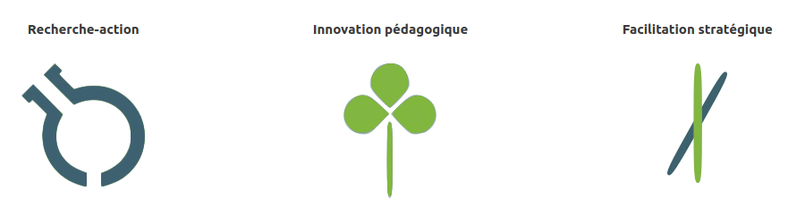

# Oxamyne - Coopérative de recherche

Oxamyne est une coopérative à vocation stratégique, prospective et pragmatique au service des transitions. Nous agissons dans un monde complexe en **communauté apprenante** par l’**expérimentation** et la **recherche-action**. Nous créons des conditions favorables aux transformations par les **Communs**, l’**entrepreneuriat** et la **coopération**.

**Oxamyne** est **une entreprise coopérative basée à Lyon,** co-portée par l’association [la MYNE](https://lamyne.org) et la coopérative d’entrepreneur·es [Oxalis](https://www.oxalis-scop.fr/). Elle réunit des coopératrices et coopérateurs d’horizons, de compétences et d’expertises riches et complémentaires, polyvalents et atypiques. Elle s’appuie sur la culture de La MYNE qui se caractérise par l’_hybridation_ des savoirs-faire \(ingénierie, design, artisanat, politique, recherche, organisation etc.\) et la _bien-traitance_ des personnes contribuant aux _Communs_.

**Pour en savoir plus :** [**https://www.oxamyne.coop**](https://www.oxamyne.coop)\*\*\*\*

