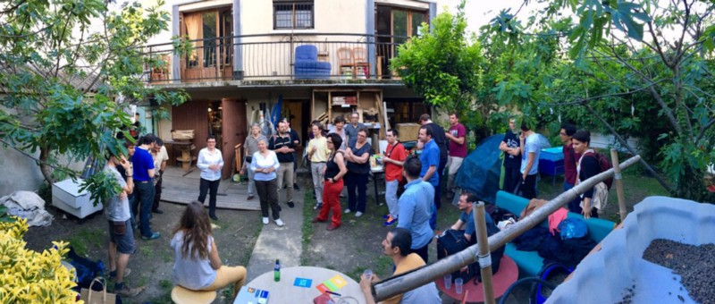

# Oxamyne ou “l’entrepreneuriat coopératif”

En réponse à la publication de l’article “[_A Lyon, la MYNE expérimente l’entrepreneuriat coopératif_](http://www.makery.info/2017/05/30/a-lyon-la-myne-experimente-lentrepreneuriat-cooperatif/)” sur Makery.

Afin d’éviter toute confusion, incompréhension et tout raccourci sur les activités menées à la MYNE sur — ce qui est présenté comme de — “l’entrepreneuriat coopératif”, ce post vise à clarifier et expliciter certaines approximations et réductions au sein de [cet article](http://www.makery.info/2017/05/30/a-lyon-la-myne-experimente-lentrepreneuriat-cooperatif/).

Il est par ailleurs le résultat de la coopération de plusieurs membres de la communauté de la MYNE qui ont souhaité participer à apporter des précisions et un point de vu plus large que celui pris par l’article.

## Avant tout : Oxamyne, c’est quoi ? 

[Oxamyne](http://oxamyne.fr) est une expérimentation menée entre la [MYNE](http://lamyne.org) et [Oxalis](http://www.oxalis-scop.fr/) sur la structuration d’une entité commune permettant le portage des activités économiques et entrepreneuriales des personnes ou projets de ces deux communautés dans une perspective de participation active aux communs.

La réflexion autour du développement d’une organisation commune entre Oxalis et la MYNE a émergé au cours de l’année 2016 et s’est formalisée lors des travaux et rencontres réalisées en fin d’année (voir notamment le compte-rendu [AG 2016 de La MYNE](https://pad.lamyne.org/s/ByBGQpmHW)). Cette réflexion a donné lieu à une “[_**Note de préfiguration Oxamyne**_](https://docs.google.com/document/d/1xbuQVtPSa_diMZ3vR9u3vHLDavcx4yVTLqHThhjuJ-Y/edit)_**”**_ présentant plus en détail les tenants et aboutissants de l’expérimentation Oxamyne.

Ci-après, vous trouverez quelques éléments succints sur le fonctionnement prévisionnel et en cours de construction de Oxamyne.

### **Le fonctionnement vu par la MYNE** 

### **Fonctionnement vu par Oxalis** 

_**Cette brève description n’a pas pour vocation d’être exhaustive, mais de donner quelques clefs de compréhension nécessaires à la déconstruction de l’article paru dans Makery “**_[_**A Lyon, la MYNE expérimente l’entrepreneuriat coopératif**_](http://www.makery.info/2017/05/30/a-lyon-la-myne-experimente-lentrepreneuriat-cooperatif/)_**” sur les points qui sont abordés dans les sections suivantes.**_

## Oxamyne : “une entité interne” 

Oxamyne n’est pas _“une entité interne au hackerspace \[ndlr. La MYNE\]”_. C’est une entité qui aujourd’hui, dans sa préfiguration, pourra être un établissement secondaire de Oxalis et sera co-porté par la MYNE et Oxalis. La gouvernance a pour vocation d’être partagée et ouverte, pilotée par les porteurs de projets entrepreneuriaux.

Par ailleurs, _“le hackerspace” ne “compte” pas “se doter d’une entité inspirée de la coopérative Oxalis”_; nous n’en n’avons pas l’ambition, car ni le temps ni les compétences, et préférons expérimenter en coopération avec Oxalis plutôt que de se doter d’une structure propre. OxaMYNE n’est en aucun cas la propriété de la MYNE. De plus, s’il est vrai que “_les règles doivent être adaptées au fonctionnement particulier du lieu”,_ le fonctionnement du lieu n’a que peu d’impact, par contre les pratiques au sein de communautés ouvertes nécessitent effectivement de se mettre d’accord de manière collégiale sur des règles communes. Il reste clef de distinguer soigneusement, sous le terme “La MYNE”, les notions de lieu \(espace physique\), des pratiques mises en place, des projets supportés par la MYNE et de la \(les\) communauté\(s\) de personnes.

> A ce propos voir “[_La MYNE : une Manufacture des Idées et Nouvelles Expérimentations autonome\*_](https://medium.com/@rieult/la-myne-une-manufacture-des-id%C3%A9es-et-nouvelles-exp%C3%A9rimentations-autonome-8b7ce1e835f5)”

## Les membres, les projets et la réciprocité 

40 membres actifs est un chiffre réducteur au vu de la communauté et plus largement de l’écosystème de La MYNE. Chiffrer le nombre de personnes coopérant et contribuant à la dynamique n’est pas dans la logique de la communauté puisque l’open-source et le hacking permettent justement d’entremêler et de confondre les communautés. Parler de plusieurs dizaines de membres actifs et acteurs serait plus approprié pour donner une idée de la taille de la communauté.

“Des projets” n’ont pas été portés en tant que tels “pour la Biennale du design de Saint-Étienne en mars et avril dernier”. La MYNE, en tant qu’entité et en tant que communauté de projets, a pris part à la Biennale Internationale de Design dans un processus qui a duré près de 16 mois. Les projets n’ont pas été spécifiquement développés pour la Biennale; la Biennale a été un prétexte, pour des projets déjà présents \(comme dans un processus projet classique\), pour révéler les processus sous-jacents au développement de ces projets dans des contextes dits “tiers-lieux”.

Sur les “contrats de réciprocité”,

> “La première étape a été de créer des « contrats de réciprocité », par lesquels « les parties prenantes déclarent qui elles sont et ce qu’elles attendent de la relation », décrypte Benjamin. Un outil juridique donc, mais qui statue autant sur les valeurs que sur les contraintes des parties.”\).

ils sont hors du jeu direct et n’ont, à priori, aucun lien direct avec OxaMYNE. Il ne s’agit que d’une source d’inspiration expérimentale sur les nouveaux modes de collaboration. Par ailleurs, l’utilisation d’ “accord de réciprocité” ou “cadre de réciprocité” plutôt que “contrat” est préférée à la MYNE. Enfin, ce n’est en aucun cas un “outil juridique” car il n’a aucune valeur légale, juste morale.

Concrétement, l’accord “créé avec le cabinet d’études et de conseils [Nova7](http://www.nova7.fr/)” est un cadre dit “de réciprocité”, d’ordre moral et non contraignant juridiquement, régissant notamment certaines résidences au sein de Nova7. Nous travaillons avec eux sur des thématiques croisées en lien avec les tiers-lieux notamment. De même, concernant la coopérative [Coexiscience](http://coexiscience.fr/), Benjamin mentionne des différences de langages, entre le monde de la start-up et du numérique, et celui des chartes académiques . C’est la confrontation de ces différences qui a mené à un travail de construction d’un cadre de réciprocité, afin de prévenir toute incompréhension. Il ne s’agissait pas d’une opposition aussi marquée que l’extrait de l’article le laisse entendre.

## L’entrepreneuriat coopératif, Oxamyne et la MYNE 

> “Côté entreprises aussi, la Myne attire : Veolia, Bouygues ou Nexity se sont montrés intéressés, ainsi que des PME de l’économie numérique. Bref, « le carnet de commandes est plein », fait savoir Benjamin Chow-Petit, membre actif, qui annonce 150000€ d’activités pour l’année à venir, et ce, « avant même d’avoir fait de la prospection commerciale »”.

Nous sommes encore un élément de curiosité dans l’écosystème lyonnais autour duquel se cristallise en effet des intentions, qu’elles viennent de grands groupes, de PME \(du numérique ou pas\) mais aussi d’autres associations, de la société civile, des collectivités… Le fait de mettre l’accent sur des “grands groupes” a pour effet de réduire la réalité de nos activités et de nos volontés.

Le terme de “_carnet de commandes_” est abusif et ne reflète pas la réalité des relations et surtout des modalités de collaborations que nous essayons de nouer avec des acteurs \(qu’ils soient économiques ou non\). Nous ne répondons pas à des commandes, nous co-construisons les “cahiers des charges”, en fonction des “besoins” et, de préférence, sur des bases de “réciprocité” pour que cela profite à la production et la contribution au commun.

L’annonce de “_150000€ d’activité_” ne peut donc avoir à ce stade de réalité que prévisionnelle, et ne concerne pas la MYNE en tant que telle mais bien la structure OxaMYNE co-portée par la MYNE et Oxalis. Nous sommes loin d’une “manne commerciale” et beaucoup plus proche de relations en partie commerciales et en partie partenariales visant à instancier la réciprocité. Le but n’est pas par ailleurs de “l’intégrer… dans cette maison”, mais effectivement de penser une juste distribution de la valeur pour l’ensemble de la communauté dans le cadre d’une gouvernance partagée et ouverte. Cette structure co-portée aura pour vocation a être régie avec le même soucis de qualité d’éthique, d’ouverture et de transparence que ce que nous nous efforçons de mettre en place à la MYNE.

Enfin, nous ne faisons pas de “_prospection commerciale_”. Le point souligné par Benjamin relève de la réalité des pratiques et ne doit pas être lu comme un potentiel de développement commercial inexploité.

> Le réductionnisme du langage exporté du monde du conseil, et plus largement de l’économie de marché, pour le coller à des pratiques plus complètes et complexes nécessite d’être déconstruit.

## C’est pour quand et est ce que c’est documenté ? 

> _“Une fois la partie administrative passée, qui devrait durer environ un mois selon Benjamin Chow-Petit”_

Il n’y a à ce jour que peu de visibilité sur l’existence juridique et le fonctionnement de Oxamyne: nous apprenons en marchant et en expérimentant. En effet, le co-construction de cet outil nécessite un travail de fond de médiation et d’appropriation, ainsi que sur la gouvernance ouverte et partagée que nous souhaitons mettre en place. Le timing annoncé ne concerne donc que la partie administrative propre, suivie d’expérimentations multiples et donc sans dates annoncées.

> _“Le modèle, qui sera, comme les autres projets de la Myne, documenté, pourra-t-il ensuite servir à d’autres tiers-lieux ? « On a d’abord besoin d’explorer et de l’essayer avant de dire qu’on peut reproduire et essaimer », tempère-t-il”_

L’ensemble est et sera documenté. Il ne s’agit pas de prêcher l’essaimage ou la reproduction d’un modèle, mais de défricher et d’explorer. Cette documentation servira de fait les autres tiers-lieux, sous couvert d’appropriation de tout ou partie pour expérimenter et croiser les retours d’expériences.

> En bref: le vocabulaire et l’approche de [cet article](http://www.makery.info/2017/05/30/a-lyon-la-myne-experimente-lentrepreneuriat-cooperatif/), résolument “économie de marché” n’est, selon nous, pas en phase avec les valeurs et pratiques de la MYNE car bien trop réducteur.

En espérant que ces éléments apportent un éclairage sur l’expérimentation en cours autour d’OxaMYNE.

> **Note**: les interventions de [Michel Lallement](http://lise-cnrs.cnam.fr/le-laboratoire/les-membres-du-lise/michel-lallement-620946.kjsp) et de [Marie-Christine Bureau](http://lise-cnrs.cnam.fr/le-laboratoire/les-membres-du-lise/marie-christine-bureau-623635.kjsp) retranscrites dans l’article sont pertinentes et l’étoffent de manière efficace.

Si vous êtes intéressés par cette expérimentation et que vous souhaitez y contribuer n’hésitez pas à nous en faire part à la MYNE [\(http://lamyne.org](http://lamyne.org)\), sur les réseaux \([facebook](https://www.facebook.com/groups/644546245604963/) ou [twitter](https://twitter.com/laMYNE_)\) ou encore en commentaire de l’article “[_A Lyon, la MYNE expérimente l’entrepreneuriat coopératif_](http://www.makery.info/2017/05/30/a-lyon-la-myne-experimente-lentrepreneuriat-cooperatif/)”.

